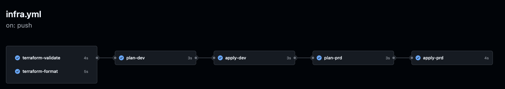
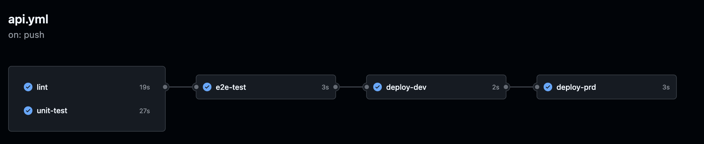

## Setup

This is a monorepo setup, so jump into the component details to set up the backend, infrastructure, and web app.

- [API](../api/README.md)
- [Infra](../infra/REAME.md)

## Pipelines

### Terraform pipeline

### NodeJS pipeline

