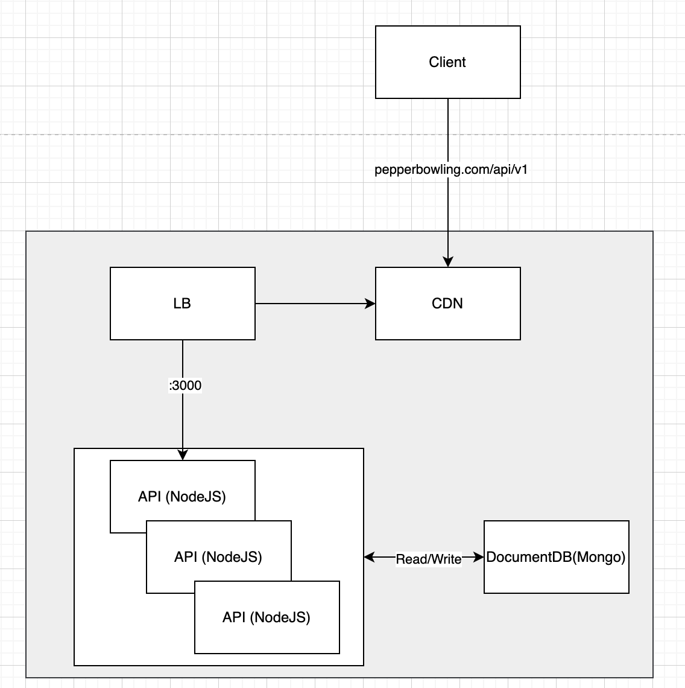

# Solution

This solution implements a scalable and resilient backend for the Pepper Bowling application.
Clients interact with the system via the domain `pepperbowling.com/api/v1`,
which resolves to a load balancer distributing traffic across multiple API instances.
These APIs, built with NestJS, manage bowling game logic and persist data in a MongoDB DocumentDB.
The architecture is designed for high availability, performance, and maintainability.

## Architecture Diagram

```
[Client (React Application)]
    ↓
[DNS: pepperbowling.com/api/v1]
    ↓
[Load Balancer (e.g., AWS ALB, NGINX)]
    ↓
[API Instances (NestJS)]
    ↓
[DocumentDB (MongoDB)]
```

We’ve opted for a straightforward design, as illustrated in the diagram below.



- Client: Web or mobile application making HTTP requests.
- DNS: Resolves `pepperbowling.com/api/v1` to the load balancer's IP.
- Load Balancer: Distributes traffic across API instances.
- API Instances: NestJS-based microservices handling game logic.
- DocumentDB: MongoDB instance storing game data.

## Components

- Client: The frontend application (React) supports a UI for starting a game, submitting frames, and retrieving scoreboards. The client calls the API to start a game and then makes requests to id/frame to update the frame when it is finished.
- DNS: Domain Name System (DNS) resolves `pepperbowling.com/api/v1` to the load balancer, configured with Route 53.
- Load Balancer: Distributes incoming traffic across multiple API instances for load balancing and failover, configured with ALB
- API Instances: NestJS-based microservices handling business logic. Deployed as multiple instances behind the load balancer, auto-scaled based on traffic.
- DocumentDB: Persistent storage for game data (e.g., player scores, frames).

## Future Enhancements

- Caching: Add Redis for scoreboard caching.
- CI/CD: Expand GitHub Actions for deployment. All the workflows under `.github` folder.

## CI/CD Workflows with GitHub Actions

```
[GitHub Actions Workflows]
    ├── API Workflow (lint, unit tests, E2E tests, deploy to envs)
    └── Infra Workflow (validate, plan, apply Terraform)
    └── WebApp Workflow (lint, unit tests, deploy to envs)
```

GHA: [All workflows](https://github.com/nvs2394/bowling-score-api/actions)